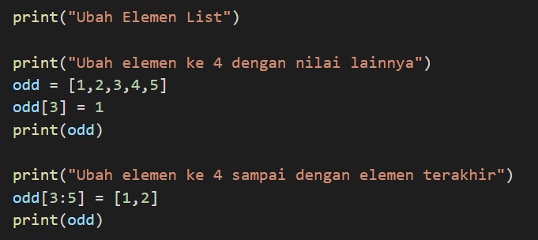
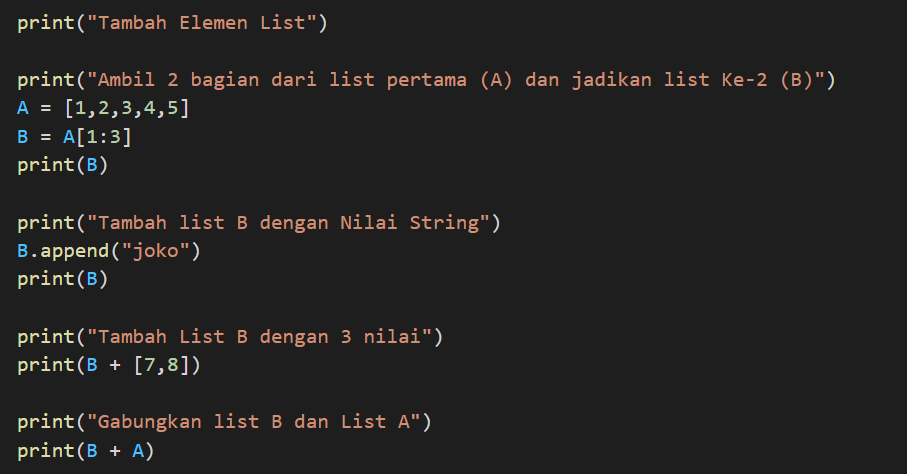

# Pratikum4
## tugas bahasa pemograman
Nama : Michael valentino laisina

Nim : 312110045

Kelas : TI.21.C1

### Latihan List
file : latihan.py

AKSES LIST

Sebuah list sebanyak 5 elemen yaitu 1 sampai 5, jika ingin menampilkan urutan yang ke 3, hitung memulai dari nol/0 dan seterus nya, dan bisa juga menggunakan tanda negatif(-) untuk menampilkannya khusus nya bahasa pyton. Jika ingin menampilkan urutan 2 sampai 4 sama seperti yang diatas, menghitung nya dimulai dari nol/0 menggunakan tanda titik dua (:) contoh nya 2 sampai 4 sama dengan 1:4. jika ingin mengambil urutan terakhir dari list, bisa menghitung dari nol/0 atau bisa juga menggunakan tanda negatif(-) yang terhitung dari belakang urutan khusus untuk bahasa pyton, contohnya -1 yang terhitung dari belakang untuk menampilkan urutan terakhir.

script program :

output :

UBAH ELEMENT LIST

Mengubah elemen ke 4 dengan nilai lainnya, dan mengubah elemen ke 4 sampai dengan elemen terakhir
script program :
 

output yang dihasilkan :

TAMBAH ELEMENT LIST

1. mengambil 2 bagian dari list pertama (A) dan jadikan list ke 2 (B)

2. tambah list B dengan nilai string

3. tambah list B dengan 3 nilai

4. gabungkan list B dengan list A

berikut contoh script :

output yang dihasilkan :

### Pratikum 4
file : pratikum4.py

berikut program sederhana untuk menambahkan data kedalam sebuah list

program ini untuk mahasiswa menghitung nilai tugas, nilai uts, nilai uas, dan menghitung keseluruhan yaitu nilai akhir dengan pertama-tama user menginput Nama dan Nim, dan program ini diatur menggunakan perulangan, jika user belum selesai menginput, input "y" untuk melanjutkan proses penginputan dan jika user sudah selesai menginput dan ingin mengetahui hasil dari nilai-nilai yang sudah diinputkan, input "t" program terhenti dan hasil akan keluar.

berikut script program :

output yang dihasilkan :

flowchart :

sekian terimakasih..

