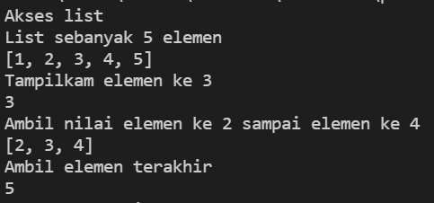

# Pratikum4
## tugas bahasa pemograman
Nama : Michael valentino laisina

Nim : 312110045

Kelas : TI.21.C1

### Latihan List
AKSES LIST

Sebuah list sebanyak 5 elemen yaitu 1 sampai 5, jika ingin menampilkan urutan yang ke 3, hitung memulai dari nol/0 dan seterus nya, dan bisa juga menggunakan tanda negatif(-) untuk menampilkannya khusus nya bahasa pyton. Jika ingin menampilkan urutan 2 sampai 4 sama seperti yang diatas, menghitung nya dimulai dari nol/0 menggunakan tanda titik dua (:) contoh nya 2 sampai 4 sama dengan 1:4. jika ingin mengambil urutan terakhir dari list, bisa menghitung dari nol/0 atau bisa juga menggunakan tanda negatif(-) yang terhitung dari belakang urutan khusus untuk bahasa pyton, contohnya -1 yang terhitung dari belakang untuk menampilkan urutan terakhir.

script program :

output :

UBAH ELEMENT LIST

